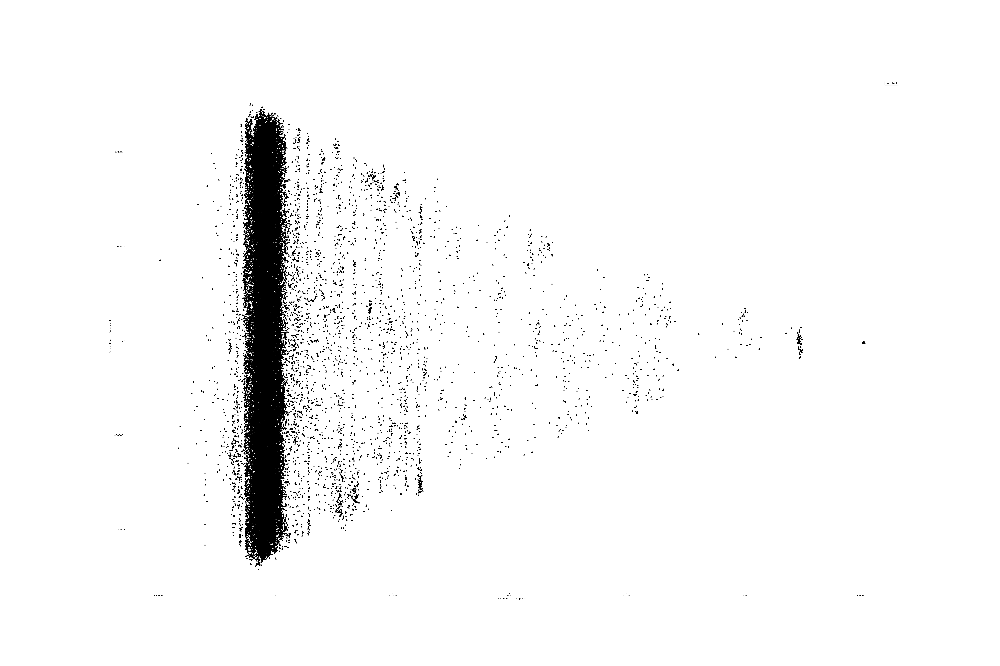
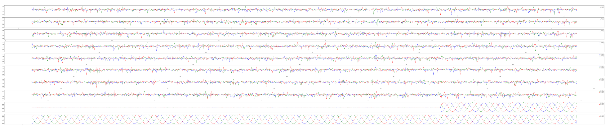
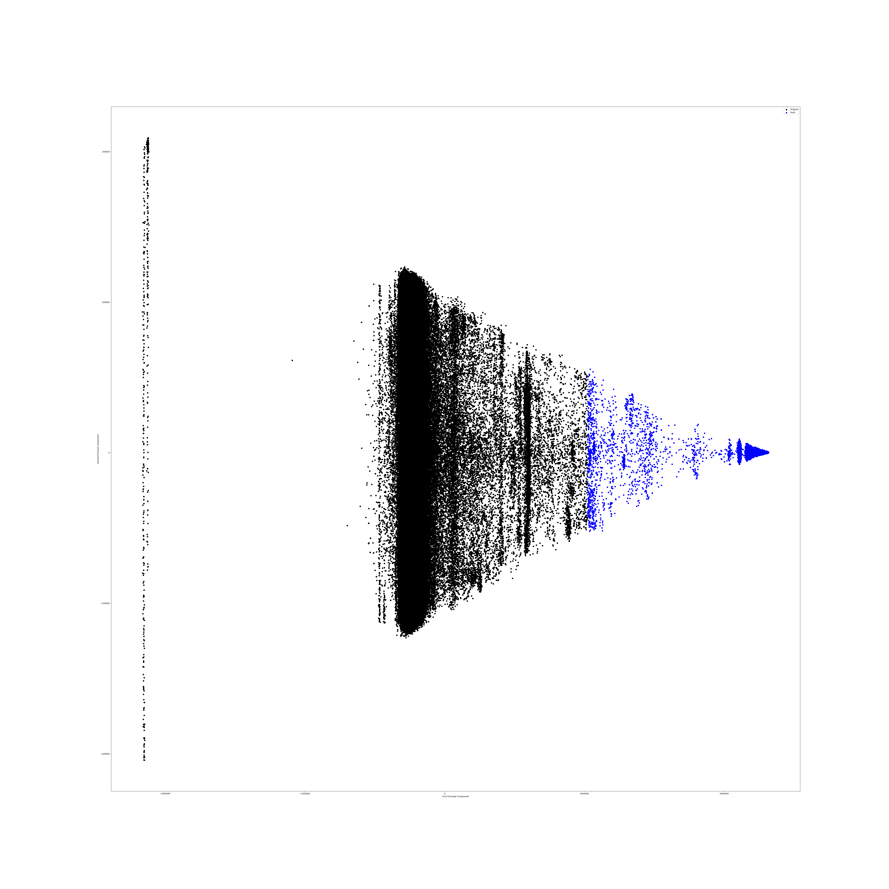

설비 고장 예지 알고리즘
=====================

## 1. 배경 및 목표

### 1.1 Background
- 한국전력에서는 PQ meter와 FRTU를 이용해 배전선로에서 발생하는 파형을 취득, FA망을 통해 데이터 전송하여 PQMS에서 수집
- PQMS는 규칙 기반 방법으로 이상 파형을 탐지
  - 기준이 명확하게 설정하지 않으면 정확도가 낮아진다.

- Example
  - 데이터 분포

  - 규칙기반 방법

### 1.2 Objective
- **4차 산업 혁명의 핵심 기술 중 하나인 머신러닝 기법을 적용하여 이상 파형 탐지 및 분류의 정확도를 높임**

- Example
  - Clustering

--------------------------------------

## 2. Introduction to Data

### 2.1 데이터 소개

- 데이터의 종류 : SagSwell파형, 고장파형, 특이파형, 중첩파형, 1분RMS
  - Sag/Swell파형 : 순간적인 전압 강하 / 순간적인 전압 상승이 나타난 경우 저장되는 파형
  - 고장파형 : 고장전류가 Pickup 기준을 초과하고 CB(Circuit Breaker)접점이 개방되는 경우에 저장되는 파형
    - 정현파의 형태를 보이지 않는 경우

  - 특이파형 : 고장전류가 Pickup 기준을 초과하는 경우와 비선형 전류변화가 감지되는 경우 저장되는 파형
  - 1분RMS : N상 전류가 기준치 이상을 일정기간동안 초과하는 경우 저장되는 파형
  - 중첩파형

- 데이터 기본 정보

- 데이터 분포도
  - 1분RMS는 데이터파일이 없어서 분포도 확인불가
  - 중첩파형은 1주기에 128샘플이고, 데이터 파일 개수가 10개 미만이여서 추후에 확인 예정

**1. SagSwell파형**

- 2D

- 3D

**2. 고장파형**

- 2D

- 3D

**3. 특이파형**

- 2D

- 3D

**4. SagSwell파형, 고장파형, 특이파형 분포도**

- 2D

- 3D

- 데이터 분포도 Conclusion
  - SagSwell파형, 고장파형, 특이파형 분포도가 거의 유사
  - SagSwell파형에서만 Swell파형 관측

### 2.2 데이터 시각화를 통한 분석

- 분석을 위해 사용할 데이터 Column : 전압
  - Why?
    - 전류는 파형의 형태를 알아보기 힘들며, 값의 변화폭이 높기 때문에 분석에 용이하지 않다.

    - 가야변전소의 SagSwell파형 전류 그래프

- **이상 파형 종류 리스트**

| 파형 종류(2017년 이후) | SagSwell파형 | 고장파형 | 특이파형 |
| :---: | :---: | :---: | :---: |
| 데이터 파일의 수 | 3,719 | 239 | 16,452 |
| Sag 파형의 형태 | O | O | O |
| Swell 파형의 형태 | O | X | X |
| 파형을 알 수 없는 형태 | O | O | o |
| 주기의 흐름을 벗어난 형태 | O | O | O |
| 정현파의 형태가 불안정한 형태 | O | O | O |
| 2개의 상이 겹처 보이는 형태 | O | O | O |
| 낮은 진폭의 주기를 띄는 형태 | O | O | O |
| 복합적인 형태 | O | O | O |

#### 2.2.1 이상 파형 종류 시각화

1. Sag파형의 형태

- 전압

- 전류

2. 파형을 알 수 없는 형태

- 전압

- 전류

3. 주기의 흐름을 벗어난 형태

- 전압1

- 전류1

- 전압2

- 전류2

4. 정현파의 형태가 불안정한 형태

- 전압

- 전류

5. 2개의 상이 겹쳐 보이는 형태

- 전압

- 전류

6. 복합적인 형태

- 전압

- 전류

7. 낮은 진폭의 주기를 띄는 형태

- 전압

- 전류

- 전압의 진폭

8. Swell파형의 형태

- 전압

- 전류

#### 2.2.2 중첩파형

- 전압

- 전류

--------------------------
### 3. Problem Definition

**1. Data Imbalance**
- 특히 Sag, Swell파형의 수가 적다.

**2. Preprocessing?**
- 어떻게 데이터를 정제할 것인가?

**3. Which machine learning techniques will be used to classify?**
- 정답이 주어지지 않았다.

--------------------------
### 4. Solution

#### 4.1 Data Imbalance

**Cause**
- Sag파형과 Swell파형은 정상파형에 비해 데이터 갯수가 부족
- 모든 데이터 파일에 Sag파형이 존재하는게 아니므로 데이터 확보가 필요하다.

> Ex) Sag파형과 정상파형 그래프 시각화

> SagSwell파형의 VOLTAGE의 A상의 주기별 파형분류

| 변전소 | 남시화변전소 | 남창변전소 | 가야변전소 | 금촌변전소 | 고흥변전소 |
| :---: | :---: | :---: | :---: | :---: | :---: |
| 정상파형 | 38 | 39 | 89 | 86 | 38 |
| Sag파형 | 8 | 7 | 0 | 0 | 4 |
| 정상파형 | 40 | 43 | 0 | 0 | 43 |
| 총 파형수  | 86 | 89 | 89 | 86 | 85 |

> SagSwell파형의 VOLTAGE의 B상의 주기별 파형분류

| 변전소 | 남시화변전소 | 남창변전소 | 가야변전소 | 금촌변전소 | 고흥변전소 |
| :---: | :---: | :---: | :---: | :---: | :---: |
| 정상파형 | 38 | 39 | 39 | 38 | 38 |
| Sag파형 | 5 | 7 | 7 | 5 | 5 |
| 정상파형 | 43 | 43 | 43 | 43 | 42 |
| 총 파형수  | 86 | 89 | 89 | 86 | 85 |

> SagSwell파형의 VOLTAGE의 C상의 주기별 파형분류

| 변전소 | 남시화변전소 | 남창변전소 | 가야변전소 | 금촌변전소 | 고흥변전소 |
| :---: | :---: | :---: | :---: | :---: | :---: |
| 정상파형 | 38 | 39 | 39 | 86 | 39 |
| Sag파형 | 6 | 7 | 7 | 0 | 4 |
| 정상파형 | 42 | 43 | 43 | 0 | 43 |
| 총 파형수  | 86 | 89 | 89 | 86 | 85 |

- **VOLTAGE 주기별 파형분류 Conclusion**
  - 38주기 or 39주기 : 정상파형
  - 3주기 ~ 8주기 : Sag파형
  - 40 ~ 43주기 : 정상파형 (대부분이 43주기)
- 데이터 비율이 약 10 : 1의 비율로 형성되어 있다.

**Solution(진행 예정)**

- GAN(Generative Adversarial Net)

  - 참고사이트 : https://hollobit.github.io/All-About-the-GAN/#whats-gans
  - 참고사이트 : https://www.youtube.com/watch?v=odpjk7_tGY0

#### 4.2 Preprocessing

- 데이터 파일마다 32샘플로 나누어 1개의 row로 설정

**1. 오름차순 정렬**
- 데이터 파일마다 주기의 시작지점이 다르다.

- 오름차순 정렬을 통해 데이터의 진행흐름을 같게 해준다.

- 오름차순 정렬을 통한 정상파형과 Sag파형 비교

**2. 주성분 분석을 통한 차원 축소**
- 일정 차원을 넘으면 분류기의 성능은 점점 떨어져 0으로 수렴
- 32차원의 데이터를 시각화하여 보여줄 수 있는 방법X

- 차원 축소를 통하여 데이터의 의미를 제대로 표현하는 특징을 추려내는 것
- 주성분 분석 : 데이터의 분포를 가장 잘 표현하는 성분을 찾아주는 것
- Ex) 고장파형을 주성분 분석을 통하여 차원 축소 후 나온 결과

  - 참고사이트 : https://medium.com/qandastudy/mathpresso-%EB%A8%B8%EC%8B%A0-%EB%9F%AC%EB%8B%9D-%EC%8A%A4%ED%84%B0%EB%94%94-15-%EC%B0%A8%EC%9B%90-%EC%B6%95%EC%86%8C-dimensionality-reduction-76b13460506f

#### 4.3 Which machine learning techniques will be used to classify?

**1. Clustering**
- 비지도 학습 방법
  - 정답이 없다.
- 비슷한 개체끼리 한 그룹으로, 다른 개체는 다른 그룹으로 묶는 방법
- K-Means, Mean-Shift, DBSCAN, Gaussian Mixture Models(GMM)을 사용한 Expectation-Maximization(EM), Agglomerative Hierarchical

**1.1 K-Means Clustering**
- n개의 중심점을 찍은 후에, 각 점간의 거리의 합이 가장 최소화가 되는 중심점 n의 위치를 찾고, 이 중심점에서 가까운 점들을 중심점을 기준으로 묶는 클러스터링 알고리즘

1.1.1 Clustering 평가 방법
- Silhouette
  - 한 클러스터 안의 데이터들이 다른 클러스터와 비교해서 얼마나 비슷한가를 나타낸다.
    - 클러스터 안의 거리가 짧을수록 좋고, 다른 클러스터와의 거리는 멀수록 좋다.
    - 실루엣은 -1부터 1사이의 값을 가진다.
    - 값이 높을수록 좋다.

1.1.2 1차원으로 차원축소후 K-Means Clustering 진행

- Result
  - Clustering : 2

  - Clustering : 3

  - Clustering : 4

  - Clustering : 5

- Conclusion : 1차원으로 군집분석 진행시 생각했던 군집의 형태를 띄었다.

1.1.3 2차원으로 차원축소후 K-Means Clustering 진행

- Result
  - Clustering : 2

  - Clustering : 3

  - Clustering : 4

  - Clustering : 5

- Conclusion : 2차원으로 군집분석 진행시 y축에 의하여 정상파형이 2개로 갈라져 분류가 됨
- 해결책 : 모든 데이터의 y축값을 Normalization하고 Clustering 진행

1.1.4 2차원 차원축소, y축값 Normalization후 K-Menas Clustering 진행

- Result
  - Clustering : 2

  - Clustering : 3

  - Clustering : 4

  - Clustering : 5

- Conclusion : 데이터 분포의 형태를 파악하기 쉽고 생각했던 군집의 형태를 띄었다.

- 군집 안의 파형 데이터 종류
1. 정상파형 형태

2. 고장파형 형태

3. 특이파형 형태

4. Swell파형 형태

5. Sag파형 형태

**1.2 DBSCAN**
- 클러스터의 갯수를 미리 지정하지 않은 군집 알고리즘
- 데이터의 밀집지역이 한 클러스터를 구성하며 비교적 비어있는 지역을 경계

1.2.1 2차원으로 차원축소후 DBSCAN 진행
- Result

- Conclusion : DBSCAN방식은 범위 설정을 해줘야하는데 범위에 대해 Normalization을 하면 MemroyError가 발생하여 진행 불가
